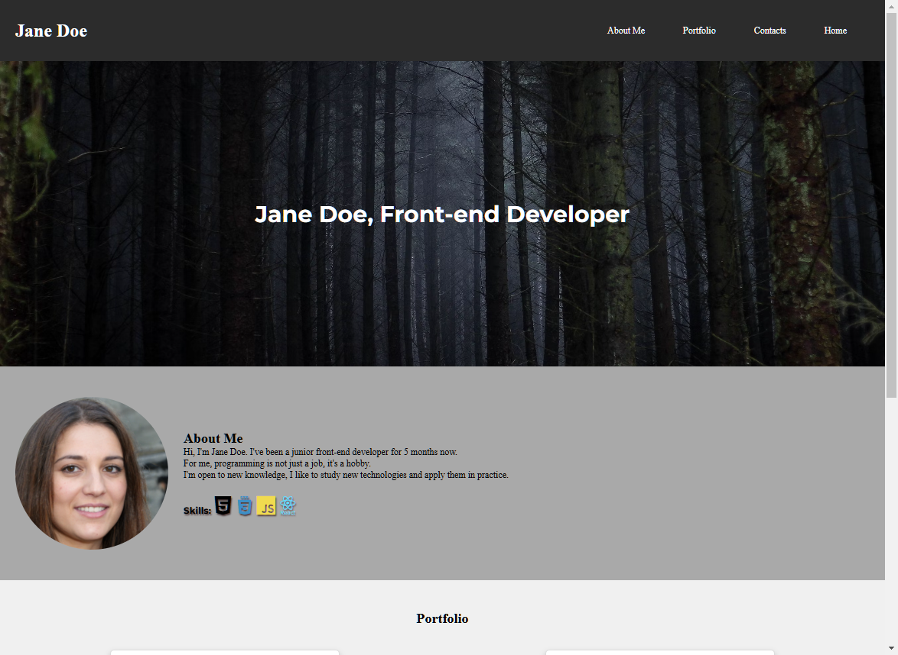
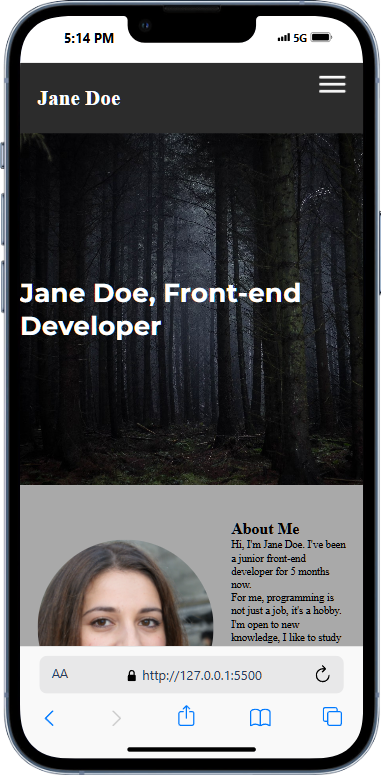

# Jane Doe's Portfolio Website

This is a responsive portfolio website for showcasing Jane Doe's work as a frontend developer. The website includes an interactive layout with project showcases, a responsive navigation bar, and a contact section with social media links. Built with HTML, CSS, and JavaScript, the site provides an elegant and professional way to present projects and skills.

## Features

- **Responsive Design**: The site is fully responsive, adapting to various screen sizes from desktop to mobile devices.
- **Hamburger Menu**: A hamburger menu is displayed on smaller screens to enhance navigation on mobile devices.
- **Project Showcases**: Displays project images and descriptions with pop-up modals for detailed project information.
- **About Section**: An about section introducing Jane Doe, with a professional headshot and a brief description.
- **Skills and Technologies**: A section listing Jane’s technical skills with relevant icons.
- **Contact Section**: Includes social media links with rounded, interactive icons.
- **Smooth Styling**: Uses Google Fonts and customized CSS for a modern, polished look.

## Technologies Used

- **HTML5**: Structure and content.
- **CSS3**: Styling, animations, and responsive design.
- **JavaScript**: Interactive elements, like the hamburger menu and modals.
- **Google Fonts**: Custom typography with the Montserrat font family.

## Screenshots

### Desktop View


### Mobile View with Hamburger Menu


## Installation

1. Clone the repository:

   ```bash
   git clone https://github.com/codelikeagirl29/jane-doe-portfolio.git
    ```